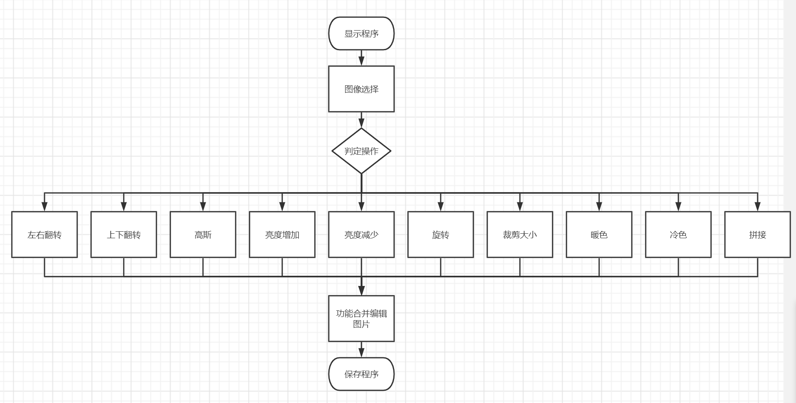

# 项目报告
---

## 项目名称
 **kittyzone-小猫图片处理程序** 


## 小组成员
- 蔺嘉诚
- 周忠康
- 罗毓康
- 惠欣宇


## ***项目描述***
       本小组制作的图片处理程序是根据现代数码相机技术的发展以及数码用户的需求而开
   发的一款实用的图片处理程序，是单机模式的Windows应用程序，实现图片的查看与编辑
   操作。
       主要内容包括：
         1.图片文件浏览：实现对图像文件的浏览。
         2.图片文件的设置：实现系统图片的设置与显示模式的设置。
         3.图片文件的编辑：实现高斯、亮度增加、亮度减少、冷色、暖色的功能。
         4.图片文件的转换：实现上下翻转、左右翻转、裁剪大小、旋转、拼接的功能
   该程序主要实现了图片的浏览、编辑、特效设置、视图设置、图片转换等几大功能。设计
   了一个类似资源管理器并带有图像预览的界面来实现文件以及图像的预览，通过图片预览
   可以进行方便的操作。视图设置实现了视图的显示与隐藏。



##项目目标
        数字图像处理系统的开发目标是开发一款完整的数字图像处理系统，实现以下功能：
    可以进行图像的转换，导入和导出，视图设置，图片编辑功能的编辑器，可以调图像的尺
    寸，图像的旋转和翻转，图片增强优化等功能。要求操作简单，能够完成数码用户的图像
    处理的需求和要求，能够完成数字图像的一些特殊处理功能包括图像的特效处理以及图像
    的颜色矩阵的处理数字图像处理系统是为了广大的数码用户进行设计的能够完成数码用户
    的常用的图像编辑与浏览操作。
   ###最低目标：重构结构体，数组，迁移重构上学期功能，并将其实现在彩色图片上。
   ###中期目标：添加适合彩色图像的几个功能：如冷暖色，拼接，以及对于亮度的调整。
   ###探索目标：继续研究qt对于图像的针对性支持，将缩放功能调整为鼠标操作，将冷暖色
   调整为调色盘模式。！[调色盘演示]https://i1.wp.com/i.stack.imgur.com/E2qi0.gif
   （需要使用鼠标，滑轮，点击等多个信号） 


## 成员分工


## c++部分

    编写了chg函数用于交换像素点，对于翻转、旋转等编辑操作无非是对像素点进行交换来实现整
体图像的编辑。
   
    ```
    void swap(double& a, double& b)
    {
        unsigned char t = a;
        a = b;
        b = t;
    }
    ```
- 功能1：实现高斯滤波，实现图像的平滑化，此功能放在"filter"头文件和"cpp"文件中。

- 功能2：实现图像的上下反转与左右反转，并以此拓展，实现对不同角度的定量旋转
    定义布尔类型的mode并作为翻转函数的参数，true为上下翻转，false为左右翻转。
        上下翻转就是对图片以水平中心线为对称轴进行像素点的互换，以高度（height）
    的二分之一为分界线，调用chg函数。
        左右翻转与上下翻转同理，以宽度（width）的二分之一为分界线，调用chg函数。
    代码如下：
   ```c++
        void Image::Flip(bool code)
        {
            if (code)
            {
                for (int i = 0; i < height / 2; i++)
                {
                    for (int j = 0; j < width; j++)
                    {
                        swap(data[i][j].R,data[height - i - 1][j].R);
                        swap(data[i][j].G,data[height - i - 1][j].G);
                        swap(data[i][j].B,data[height - i - 1][j].B);
                    }
                }
            }
            else
            {
                for (int i = 0; i < height; i++)
                {
                    for (int j = 0; j < width / 2; j++)
                    {
                        swap(data[i][j].R,data[i][width - j - 1].R);
                        swap(data[i][j].G,data[i][width - j - 1].G);
                        swap(data[i][j].B,data[i][width - j - 1].B);
                    }
                }
            }
        }
       ```
- 功能3：实现对图像亮度的调整，此功能依赖于对RGB三原色的共同增加
- 功能4：实现对图像冷暖色的调整，此功能依赖于对单独通道的调整。
        功能3与功能4逻辑相同，都是对RGB三原色的调整，在判定为某种操作后，遍历所有像素点对RGB
    进行增加（减少）。
        代码如下：
          ```c++
            void Image::Add(double delta)
            {
                for (int i = 0; i < height; i++)
                {
                    for (int j = 0; j < width; j++)
                    {
                        data[i][j].R+=delta;
                        if(data[i][j].R<0)  data[i][j].R=0;
                        else if(data[i][j].R>255) data[i][j].R=255;
            
                        data[i][j].G+=delta;
                        if(data[i][j].G<0)  data[i][j].G=0;
                        else if(data[i][j].G>255) data[i][j].G=255;
            
                        data[i][j].B+=delta;
                        if(data[i][j].B<0)  data[i][j].B=0;
                        else if(data[i][j].B>255) data[i][j].B=255;
                    }
                }
            }
- 功能5：将两张照片拼接合并，此功能依赖于不同像素点信息的复制与填充。
- 功能6：为了实现以上对图片的操作，重构了上学期"readbmp"与"writebmp"函数，使其适应对于
彩色图片的处理
以上功能除第一个外，均放在image类中实现。其余代码放在后续链接中。


## qt部分
- mainwindow主页面：
    主要学习了信号与槽函数之间的关系，并学会调用已经声明的部分函数。同时为了打开文件编写了
openimage与save函数；同时在调用相应的图片函数后，调用了相应的qlabel中setpixmap函数，实现了
处理好的图片在label控件中的显示.
        实现显示的代码如下：
        ```
            QImage* img_seen = operational_img.toQImage(operational_img);  
            ui->label->setPixmap(QPixmap::fromImage(*img_seen));  
            ui->label->setAlignment(Qt::AlignCenter);  
        ```

        以下代码体现了信号与槽，用于对象之间的通信，为各个按钮添加相应的被调函数并实现所选操作。
    在Qt中，发送对象、发送的信号、接收对象、槽可以通过很多种方式进行连接。在此我们使用connect+宏
    的方式进行通信连接。
        具体实现如下：
        ```c++
            connect(ui->actionopen, SIGNAL(triggered(bool)), this, SLOT(OpenImg()));
            connect(ui->actionsave, SIGNAL(triggered(bool)), this, SLOT(Save()));
            connect(ui->button_guassion, SIGNAL(clicked(bool)), this, SLOT(GaussionImg()));
            connect(ui->button_back, SIGNAL(clicked(bool)), this, SLOT(Back()));<br>
            connect(ui->button_flipupdown, SIGNAL(clicked(bool)), this, SLOT(Flipupdown()));
            connect(ui->button_flipleftright, SIGNAL(clicked(bool)), this, SLOT(Flipleftright()));
            connect(ui->button_lightup, SIGNAL(clicked(bool)), this, SLOT(lightup()));
            connect(ui->button_lightdown, SIGNAL(clicked(bool)), this, SLOT(lightdown()));
            connect(ui->button_cut,SIGNAL(clicked(bool)),this,SLOT(Cut()));
            connect(ui->rotate,SIGNAL(clicked(bool)),this,SLOT(rotate()));
            connect(ui->button_cat,SIGNAL(clicked(bool)),this,SLOT(Cat()));
            connect(ui->button_warm,SIGNAL(clicked(bool)),this,SLOT(warm()));
            connect(ui->button_cold,SIGNAL(clicked(bool)),this,SLOT(cold()));
            connect(ui->button_big,SIGNAL(clicked(bool)),this,SLOT(big()));       
            ui->label->setFrameShape(QFrame::Box)
        ```


## 其他
- gitee库开放与代码审查：
 此部分前期由单人审核，后续过于繁琐遂加入仓库进行共同协作


## 外部工具和资源
- qt creator
- git
- gitee
- GitHub
整合程序代码，以及编写视觉ui页面
  - 使用Qimage或Qpixmap
  - 使用qt本身控件，并自主设置软件背景。
！[exe背景图]https://image.baidu.com/search/down?tn=download&word=download&ie=utf8&fr=detail&url=https%3A%2F%2Fgimg2.baidu.com%2Fimage_search%2Fsrc%3Dhttp%253A%252F%252Fimg3.027art.cn%252Fimg%252F2021%252F08%252F28%252F1630141978119312.jpg%26refer%3Dhttp%253A%252F%252Fimg3.027art.cn%26app%3D2002%26size%3Df9999%2C10000%26q%3Da80%26n%3D0%26g%3D0n%26fmt%3Dauto%3Fsec%3D1664281802%26t%3D21144b3fe79943f8f39976ff1f5464b8&thumburl=https%3A%2F%2Fimg1.baidu.com%2Fit%2Fu%3D3335410491%2C839959637%26fm%3D253%26fmt%3Dauto%26app%3D120%26f%3DJPEG%3Fw%3D1080%26h%3D720
c++代码编写调试


## 开发动机与原则
    1.面向用户的观点
       本图片处理程序是为广大的数码用户开发研制的，用户是系统的最终使用者和评价者，
    所以在系统的开发设计的过程中，树立了从用户的需求出发，面向用户，一切为了用户
    的观念，在分析与设计系统的前期，结合计算机图像处理的特点，融合设计观点和现代
    管理的思想和模式，以便改进和提高工作的速度和质量，提高数字图像处理的效率，达
    到很好的效果。
    2.严格按阶段进行
        系统的开发设计是一项较大的工程，所以应该将整个信息系统的开发设计过程划分为
    若千阶段，相应的阶段叉要分为若干个不同的步骤，每个阶段和生骤都要有明确的工作任
    务和目标。这种有序的组织安排，条例清楚、层次分明，便于计划的制定和控制，且为后
    续工作的进行莫定了坚实的基础，提高了工作效率和质量。
    3.采用系统的观点处理
        在系统分析阶段，在对原系统进行全面调查和分析的基础上，构造系统的最佳逻辑模
    型，使用户对将来完整系统的轮廓有个初步的了解和认识，以便及时和用户进行交流和探
    讨，不断提高系统的完善性。在此基础上进行系统的物理实现和设计，切实完成逻辑模型
    的具体功能。逻辑设计和物理实现二者是相辅相成、密不可分的，这样使系统的设计更加
    稳妥合理。
    4.采用系统的观点处理
        系统模块化设计方法是从计算机实现的角度出发对整个系统进行审核和校验，将整个
    系统划分为不同的功能模块，实现系统的一个特定功能。各个功能模块之问具有相对独立
    性，便于整个系统的设计、实施、维护和扩充。这种模块化结构设计方法，为整个系统顺
    利进行奠定了基础。
    5.整个系统的设计主要采用快速原形法
        快速原形法是数字图像处理系统设计的一个重要方法。它是根据用户提出的需求，
    用户和开发者共同确定系统的基本要求和主要功能，并在一个较短的时间内建立一个实验
    性的、简单的信息系统模型，通过用户不断提出的意见和建议，对模型进行不断的修改和
    完善，直到用户比较满意为止，以便形成一个相对稳定、较为理想的系统。该方法的主要
    优点:
        (1)清楚，所有问题都围绕一个模型展开，是彼此之间联系紧密。
        (2)有助于发现用户需求，通过对原型和用户接触，能够启发我们去挖掘问题，从而
           不断修正和完善，最终得到一个理想的系统。
        (3)系统开发效率高，，开发周期短、使用灵活、容易修改，这样对于不够稳定的系
           统更加灵活。
        (4)系统的可扩展性更好，由于此方法是在原型应用中不断发展完善和修改的，所以
           有较强的扩展性。


## 准备工作
  前期同学共同学习了上学期老师给的代码以及实现的功能，完成了几个对于bmp文件的读取测试，
然后学了RGB三通道的操作方法，并迁移了上学期给出的结构体与类，然后由负责qt的同学学习了
ui界面设计，信号与槽函数等方面的知识，此期间借鉴学习了B站，csdn，GitHub等一系列网站的
教程，操作方法与开源项目，并通过对目前技术的估计，选定了对于冷暖色，亮度这一新项目的
开发。


## ***开发方法
- 使用上学期已经在面向对象编程课程中已经实现的图像类
- 对图像类进行三位拓展
- 迁移和重载所以已经实现的功能
- 使用gitee进行代码同步整合和版本控制
---


## ***开发细节

基于罗毓康同学上学期作业所给出的图像类进行修改，由周忠康同学对于图像类的几个功能进行
重构开发，蔺嘉诚同学负责对代码进行审核合并，惠欣宇同学负责对程序进行测试，并提出意见。


### ***遇到困难
- 1.在开始配置QT环境时遇到许多困难，刚开始采取vs+qt的编译模式，qt不断报错vs存在问题，后来
经过多次查阅相关博客，采取包括但不仅限重新配置环境变量，重命名中文路径，对部分文件进行
改名等尝试后，最终发现是安装的最新版本QT尚不稳定，存在诸多自身问题，遂重装QT，并采取mingw
编译而非mvsc进行编译，最终解决问题。
- 2.在对于上学期data数组进行迁移时始终遇到失真问题，经过学习发现是rgb三色信息无法完全复制，
岁自定义一个结构体来承载该信息，随后开辟空间解决。
- 3.在参考GitHub上一开源项目时，不了解pro文件代码是自动生成，又因为其中包含一qrc资源文件，
而它依赖的文件路径为上传者本地计算机项目外路径，在下载运行时qt无法找到该路径频繁运行失败，
在经过多方了解后注释掉pro文件中代码块，遂成功解决报错。
        '''#RESOURCES += \
       #    res.qrc
```
  之后在最终ui设计界面为突出学校特色，我们引入了一张图片作为ui背景，最终了解问题由来。
- 4.在对高斯滤波进行编写的过程中，我们查阅了不同的均值，中值滤波与高斯滤波，进行比较，最终
发现高斯滤波的处理效果最佳，于是使用了高斯滤波。
！[公式]https://private.codecogs.com/gif.latex?f%28x%29%20%3D%20%5Cfrac%7B1%7D%7B%5Csqrt%7B2%5Cpi%7D%5Csigma%7D%5C%2Cexp%28-%5Cfrac%7B%28x-%5Cmu%29%5E2%7D%7B2%5Csigma%5E2%7D%29

        


## ***开发成果
> 这里是bilibili演示视频地址
---


## 总结与讨论
- 1.对于本项目我们任务的重心是实现对以往功能的迁移使其适应彩色图片，在这一过程中，我们
重新学习了QT的设计方法，并第一次将ui界面按钮与代码联系起来，使得程序完成了初步的可视化。
对于新功能的选定，我们更多的是从彩色图像的特质出发，在学习了通道对冷暖色影响后决定实现
冷暖色这一功能，但基于能力有限，我们所预想的最高目标：调色盘的模式未能实现，尽管目前的
代码可以设置相应的冷暖色程度却仍需通过后端代码实现，下一步我们预想类似于剪裁功能，实现
冷暖色程度的可视化定量调节。
 - 2.通过此次对QT的浅显学习，我们逐步认识到了qt功能的强大，尽管不能过多采用第三方函数，
已有类，但qlabel类的函数的丰富性仍然令我们惊讶，在阅读后将其应用到了我们自己的函数编写
过程中。以后应该会继续使用qt类型多样功能丰富的函数，
 - 3.对于诸多开源项目的借鉴使我们最终理解了实现功能的道路，对于已有项目的借鉴也让我们
更多的理解了开源精神，但对于开源项目，上传者应该尽量减少对本机计算机的依赖，尽量将所需
文件全部上传以免不利于公众理解项目。


## ***问题收集与未来展望
---目前我们项目的功能主要集中于对于色彩处理这一部分，未来可以在深化图像色彩处理的同时，
实现轮廓识别，面积统计等功能。同时，我们将会结合未来课程的学习进程，尽量完善这一项目作为
一个有生命力的学习项目。


## 贡献度声明


## 引用参考
markdown学习-https://markdown.com.cn/editor/
高斯滤波学习- https://blog.csdn.net/u012370185/article/details/90375278?utm_medium=distribute.pc_relevant.none-task-blog-2~default~baidujs_baidulandingword~default-0-90375278-blog-81637558.pc_relevant_multi_platform_whitelistv4eslandingctr2&spm=1001.2101.3001.4242.1&utm_relevant_index=3
图片缩放学习-https://blog.csdn.net/u013480226/article/details/122491058


